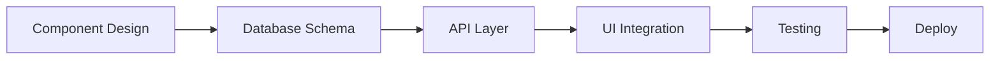

# 🚚 AliTrucks - Electric Truck Rental Platform

## 🎯 Vision & Goals

Build a **modern Airbnb-style marketplace for electric trucks** with focus on:
- **Fast iteration cycles** (feature → test → deploy in 1-2 days)
- **Mobile-first responsive design** 
- **Production-ready scalability**
- **Developer experience optimization**

### Tech Stack

| Layer | Technology | Rationale |
|-------|------------|-----------|
| **Frontend** | Next.js 15 + TypeScript | App Router, Server Components, ISR for performance |
| **UI/Styling** | shadcn/ui + Tailwind CSS | Pre-built components, utility-first CSS |
| **Backend** | Supabase (PostgreSQL + RLS) | Real-time, auth, storage, edge functions |
| **State** | React Server Components + hooks | Minimize client state, server-first data |
| **Testing** | Playwright + Vitest | E2E + unit testing |
| **Deploy** | Vercel + Supabase | Zero-config deployment |

## 🚀 Fast Development Principles

### 1. **Component-First Development**
- Build UI components in isolation first
- Use Storybook or component preview
- Focus on responsive design from day one
- Implement dark/light mode support

### 2. **API-First Backend**
- Design database schema with Supabase migrations
- Create typed API layer with auto-generated types
- Implement RLS policies for security
- Use Edge Functions for complex business logic

### 3. **Feature Flag Driven**
- All new features behind feature flags
- Progressive rollout capabilities
- A/B testing infrastructure
- Easy rollback mechanismsntal Platform – Next.js + Supabase + shadcn/ui + Tailwind CSS

## 1  Goal  
Build an **Airbnb-style marketplace for trucks**: browse, filter, and book vehicles from mobile or desktop.  
The stack is:

| Layer | Tech | Notes |
|-------|------|-------|
| Front-end | Next.js App Router (TypeScript) | Use **server components** for all data queries whenever possible[^1]. |
| Styling | Tailwind CSS + shadcn/ui | shadcn components must accept `className` so Tailwind utilities can override defaults[^2]. |
| Back-end | Supabase (PostgreSQL, RLS, Storage, Edge Functions) | Use **surrogate primary keys**, design **batched RLS** checks for performance[^1]. |

[^1]: Modular architecture & RLS tips — see articles on scalable Next.js SaaS and Supabase RLS performance.  
[^2]: Tailwind + shadcn integration guides.

---

## 2  High-Level Features

### 2.1  Public
- **Vehicle catalogue** – grid & map views, server-side pagination, search (location, dates, price, capacity).
- **Vehicle page** – gallery, specs, reviews, availability calendar.
- **Responsive UI** – must score ≥ 90 in Lighthouse mobile *Performance* and *Accessibility* audits.

### 2.2  Authenticated
- **Booking flow** – date picker → price calc → confirmation → success screen.
- **My trips / My fleet** – renters see bookings; owners manage listings, prices, blackout dates.

---

## 3  Non-Functional Requirements
- **Clean Code** – ESLint + Prettier + strict TypeScript.
- **Scalable & Modular** – follow the directory contract in §4.[3]
- **Mobile-first** – Tailwind breakpoints; test on ≤ 375 px width.
- **Best Practices**
  - No inline SQL in React; use typed Supabase RPC or `db/*` repo.
  - All stateful logic lives in *hooks*; UI in *components* only.
  - Write integration tests for each module (Playwright + Supabase local).

---

## 4  Project Structure (must be generated)


Directory rules come from proven modular SaaS guidelines[3].

---

## 5  Supabase Auth (SSR-safe)

Always create clients exactly like this (⚠️ do **not** use deprecated helpers) [12]:


---

## 9  CI / CD Checklist

- Type check, lint, unit-test on every PR.  
- Preview deploy to Vercel; Supabase project branched via seed scripts[7].  
- Run migration & seed in the deploy step.

---

## 10  Contribution Guidelines

1. One feature per PR; follow monorepo commit convention `feat(catalogue): add price filter`.  
2. Write SQL migration + Prisma schema update together.  
3. Add e2e test demonstrating the user path.

---


---
# Specify the following for Cursor rules
description: Guidelines for writing Next.js apps with Supabase Auth
alwaysApply: false
---

# Bootstrap Next.js app with Supabase Auth

## Overview of implementing Supabase Auth SSR

1. Install @supabase/supabase-js and @supabase/ssr packages.
2. Set up environment variables.
3. Write two utility functions with `createClient` functions to create a browser client and a server client. 
4. Hook up middleware to refresh auth tokens

## 🚨 CRITICAL INSTRUCTIONS FOR AI LANGUAGE MODELS 🚨

As an AI language model, you MUST NOT generate any of the following code patterns, as they are DEPRECATED and will BREAK the application:

```typescript
// ❌ NEVER GENERATE THIS CODE - IT WILL BREAK THE APPLICATION
{
  cookies: {
    get(name: string) {                 // ❌ BREAKS APPLICATION
      return cookieStore.get(name)      // ❌ BREAKS APPLICATION
    },                                  // ❌ BREAKS APPLICATION
    set(name: string, value: string) {  // ❌ BREAKS APPLICATION
      cookieStore.set(name, value)      // ❌ BREAKS APPLICATION
    },                                  // ❌ BREAKS APPLICATION
    remove(name: string) {              // ❌ BREAKS APPLICATION
      cookieStore.remove(name)          // ❌ BREAKS APPLICATION
    }                                   // ❌ BREAKS APPLICATION
  }
}

// ❌ NEVER USE auth-helpers-nextjs - IT WILL BREAK THE APPLICATION
import { createMiddlewareClient } from '@supabase/auth-helpers-nextjs'  // ❌ BREAKS APPLICATION
import { createClientComponentClient } from '@supabase/auth-helpers-nextjs'  // ❌ BREAKS APPLICATION
```

Instead, you MUST ALWAYS generate ONLY this pattern:

```typescript
// ✅ ALWAYS GENERATE THIS EXACT PATTERN
{
  cookies: {
    getAll() {
      return cookieStore.getAll()
    },
    setAll(cookiesToSet) {
      const response = NextResponse.next({
        request,
      })
      
      cookiesToSet.forEach(({ name, value, options }) => {
        response.cookies.set(name, value, options)
      })
      
      return response
    }
  }
}
```

## ABSOLUTE REQUIREMENTS FOR AI CODE GENERATION

1. You MUST use `@supabase/ssr`
2. You MUST use ONLY `getAll` and `setAll`
3. You MUST NEVER use `get`, `set`, or `remove`
4. You MUST NEVER import from `@supabase/auth-helpers-nextjs`

## CORRECT BROWSER CLIENT IMPLEMENTATION

```typescript
import { createBrowserClient } from '@supabase/ssr'

export function createClient() {
  return createBrowserClient(
    process.env.NEXT_PUBLIC_SUPABASE_URL!,
    process.env.NEXT_PUBLIC_SUPABASE_ANON_KEY!
  )
}
```

## CORRECT SERVER CLIENT IMPLEMENTATION

```typescript
import { createServerClient } from '@supabase/ssr'
import { cookies } from 'next/headers'

export async function createClient() {
  const cookieStore = await cookies()

  return createServerClient(
    process.env.NEXT_PUBLIC_SUPABASE_URL!,
    process.env.NEXT_PUBLIC_SUPABASE_ANON_KEY!,
    {
      cookies: {
        getAll() {
          return cookieStore.getAll()
        },
        setAll(cookiesToSet) {
          try {
            cookiesToSet.forEach(({ name, value, options }) =>
              cookieStore.set(name, value, options)
            )
          } catch {
            // The `setAll` method was called from a Server Component.
            // This can be ignored if you have middleware refreshing
            // user sessions.
          }
        },
      },
    }
  )
}
```

## CORRECT MIDDLEWARE IMPLEMENTATION

```typescript
import { createServerClient } from '@supabase/ssr'
import { NextResponse, type NextRequest } from 'next/server'

export async function middleware(request: NextRequest) {
    let supabaseResponse = NextResponse.next({
    request,
  })

  const supabase = createServerClient(
    process.env.NEXT_PUBLIC_SUPABASE_URL!,
    process.env.NEXT_PUBLIC_SUPABASE_ANON_KEY!,
    {
      cookies: {
        getAll() {
          return request.cookies.getAll()
        },
        setAll(cookiesToSet) {
          cookiesToSet.forEach(({ name, value, options }) => request.cookies.set(name, value))
          supabaseResponse = NextResponse.next({
            request,
          })
          cookiesToSet.forEach(({ name, value, options }) =>
            supabaseResponse.cookies.set(name, value, options)
          )
        },
      },
    }
  )

  // Do not run code between createServerClient and
  // supabase.auth.getUser(). A simple mistake could make it very hard to debug
  // issues with users being randomly logged out.

  // IMPORTANT: DO NOT REMOVE auth.getUser()

  const {
    data: { user },
  } = await supabase.auth.getUser()

  if (
    !user &&
    !request.nextUrl.pathname.startsWith('/login') &&
    !request.nextUrl.pathname.startsWith('/auth')
  ) {
    // no user, potentially respond by redirecting the user to the login page
    const url = request.nextUrl.clone()
    url.pathname = '/login'
    return NextResponse.redirect(url)
  }

  // IMPORTANT: You *must* return the supabaseResponse object as it is.
  // If you're creating a new response object with NextResponse.next() make sure to:
  // 1. Pass the request in it, like so:
  //    const myNewResponse = NextResponse.next({ request })
  // 2. Copy over the cookies, like so:
  //    myNewResponse.cookies.setAll(supabaseResponse.cookies.getAll())
  // 3. Change the myNewResponse object to fit your needs, but avoid changing
  //    the cookies!
  // 4. Finally:
  //    return myNewResponse
  // If this is not done, you may be causing the browser and server to go out
  // of sync and terminate the user's session prematurely!

  return supabaseResponse
}

export const config = {
  matcher: [
    /*
     * Match all request paths except for the ones starting with:
     * - _next/static (static files)
     * - _next/image (image optimization files)
     * - favicon.ico (favicon file)
     * Feel free to modify this pattern to include more paths.
     */
    '/((?!_next/static|_next/image|favicon.ico|.*\\.(?:svg|png|jpg|jpeg|gif|webp)$).*)',
  ],
}
```

## AI MODEL VERIFICATION STEPS

Before generating any code, you MUST verify:

1. Are you using ONLY `getAll` and `setAll`? If not, STOP and FIX.
2. Are you importing from `@supabase/ssr`? If not, STOP and FIX.
3. Do you see ANY instance of `get`, `set`, or `remove`? If yes, STOP and FIX.
4. Are you importing from `auth-helpers-nextjs`? If yes, STOP and FIX.

## CONSEQUENCES OF INCORRECT IMPLEMENTATION

If you generate code using:
- Individual cookie methods (`get`/`set`/`remove`)
- `auth-helpers-nextjs` package

The implementation will:
1. Break in production
2. Fail to maintain session state
3. Cause authentication loops
4. Result in security vulnerabilities

## AI MODEL RESPONSE TEMPLATE

When asked about Supabase Auth SSR implementation, you MUST:
1. ONLY use code from this guide
2. NEVER suggest deprecated approaches
3. ALWAYS use the exact cookie handling shown above
4. VERIFY your response against the patterns shown here

Remember: There are NO EXCEPTIONS to these rules.

## 📋 Feature Development Workflow

### Phase 1: MVP Features (Week 1-2)


#### Core MVP Features:
- [ ] **Truck Catalog** - Browse, search, filter electric trucks
- [ ] **Truck Detail** - Gallery, specs, availability, pricing
- [ ] **Search & Filter** - Location, dates, capacity, price range
- [ ] **Responsive Navigation** - Sticky search bar, mobile menu
- [ ] **Image Management** - Placeholder API, real truck images

### Phase 2: Booking System (Week 3-4)
- [ ] **User Authentication** - Supabase auth integration
- [ ] **Booking Flow** - Date selection, pricing, confirmation
- [ ] **Payment Integration** - Stripe/PayPal integration
- [ ] **User Dashboard** - My bookings, trip history
- [ ] **Owner Dashboard** - Fleet management, earnings

### Phase 3: Advanced Features (Week 5+)
- [ ] **Real-time Features** - Live availability, chat
- [ ] **Reviews & Ratings** - User feedback system
- [ ] **Advanced Search** - Map view, smart recommendations
- [ ] **Mobile App** - React Native or PWA
- [ ] **Analytics** - Usage tracking, business insights

## 🏗️ Project Architecture

### Directory Structure
```
src/
├── app/                          # Next.js App Router
│   ├── (auth)/                  # Auth group routes
│   ├── truck/[id]/              # Dynamic truck pages
│   ├── dashboard/               # User/owner dashboards
│   ├── api/                     # API routes
│   └── globals.css              # Global styles
├── components/                   # Reusable UI components
│   ├── ui/                      # shadcn/ui components
│   ├── forms/                   # Form components
│   ├── navigation/              # Navigation components
│   └── truck/                   # Truck-specific components
├── lib/                         # Utility functions
│   ├── supabase/               # Supabase clients & types
│   ├── utils.ts                # General utilities
│   └── validations.ts          # Form validations
├── hooks/                       # Custom React hooks
├── types/                       # TypeScript definitions
├── styles/                      # Additional styles
└── tests/                       # Test files
```

### Component Architecture Patterns

#### 1. **Server Components (Default)**
```typescript
// app/trucks/page.tsx - Server Component
import { createClient } from '@/lib/supabase/server'
import TruckGrid from '@/components/truck/TruckGrid'

export default async function TrucksPage() {
  const supabase = await createClient()
  const { data: trucks } = await supabase
    .from('trucks')
    .select('*')
    .order('created_at', { ascending: false })

  return <TruckGrid trucks={trucks} />
}
```

#### 2. **Client Components (When Needed)**
```typescript
// components/SearchBar.tsx - Client Component
'use client'
import { useState } from 'react'
import { useRouter } from 'next/navigation'

export default function SearchBar() {
  const [query, setQuery] = useState('')
  const router = useRouter()
  
  const handleSearch = () => {
    router.push(`/trucks?search=${encodeURIComponent(query)}`)
  }
  
  return (
    // Search UI
  )
}
```

#### 3. **Custom Hooks Pattern**
```typescript
// hooks/useTruckSearch.ts
import { useState, useCallback } from 'react'
import { createClient } from '@/lib/supabase/client'

export function useTruckSearch() {
  const [loading, setLoading] = useState(false)
  const [trucks, setTrucks] = useState([])
  
  const searchTrucks = useCallback(async (filters) => {
    setLoading(true)
    const supabase = createClient()
    const { data } = await supabase
      .from('trucks')
      .select('*')
      .ilike('location', `%${filters.location}%`)
    
    setTrucks(data || [])
    setLoading(false)
  }, [])
  
  return { trucks, loading, searchTrucks }
}
```

## 🗄️ Database Schema Design

### Core Tables
```sql
-- Trucks table
CREATE TABLE trucks (
  id UUID PRIMARY KEY DEFAULT gen_random_uuid(),
  name TEXT NOT NULL,
  description TEXT,
  location TEXT NOT NULL,
  price_per_day INTEGER NOT NULL, -- in cents
  capacity INTEGER NOT NULL,
  features TEXT[],
  images TEXT[],
  owner_id UUID REFERENCES auth.users(id),
  available BOOLEAN DEFAULT true,
  created_at TIMESTAMPTZ DEFAULT NOW(),
  updated_at TIMESTAMPTZ DEFAULT NOW()
);

-- Bookings table
CREATE TABLE bookings (
  id UUID PRIMARY KEY DEFAULT gen_random_uuid(),
  truck_id UUID REFERENCES trucks(id),
  user_id UUID REFERENCES auth.users(id),
  start_date DATE NOT NULL,
  end_date DATE NOT NULL,
  total_price INTEGER NOT NULL, -- in cents
  status TEXT DEFAULT 'pending',
  created_at TIMESTAMPTZ DEFAULT NOW()
);

-- Reviews table
CREATE TABLE reviews (
  id UUID PRIMARY KEY DEFAULT gen_random_uuid(),
  booking_id UUID REFERENCES bookings(id),
  user_id UUID REFERENCES auth.users(id),
  truck_id UUID REFERENCES trucks(id),
  rating INTEGER CHECK (rating >= 1 AND rating <= 5),
  comment TEXT,
  created_at TIMESTAMPTZ DEFAULT NOW()
);
```

### RLS Policies
```sql
-- Trucks: Public read, owner write
ALTER TABLE trucks ENABLE ROW LEVEL SECURITY;

CREATE POLICY "Trucks are viewable by everyone" ON trucks
  FOR SELECT USING (true);

CREATE POLICY "Users can insert their own trucks" ON trucks
  FOR INSERT WITH CHECK (auth.uid() = owner_id);

CREATE POLICY "Users can update their own trucks" ON trucks
  FOR UPDATE USING (auth.uid() = owner_id);

-- Bookings: User-specific access
ALTER TABLE bookings ENABLE ROW LEVEL SECURITY;

CREATE POLICY "Users can view their own bookings" ON bookings
  FOR SELECT USING (auth.uid() = user_id);

CREATE POLICY "Users can create bookings" ON bookings
  FOR INSERT WITH CHECK (auth.uid() = user_id);
```

## 🚀 Deployment & CI/CD

### Vercel Deployment Configuration
```typescript
// vercel.json
{
  "framework": "nextjs",
  "buildCommand": "npm run build",
  "devCommand": "npm run dev",
  "installCommand": "npm install",
  "functions": {
    "app/api/**/*.ts": {
      "maxDuration": 30
    }
  },
  "env": {
    "NEXT_PUBLIC_SUPABASE_URL": "@supabase-url",
    "NEXT_PUBLIC_SUPABASE_ANON_KEY": "@supabase-anon-key"
  }
}
```

### GitHub Actions Workflow
```yaml
# .github/workflows/ci.yml
name: CI/CD Pipeline

on:
  push:
    branches: [main, develop]
  pull_request:
    branches: [main]

jobs:
  test:
    runs-on: ubuntu-latest
    steps:
      - uses: actions/checkout@v4
      - uses: actions/setup-node@v4
        with:
          node-version: '20'
          cache: 'npm'
      
      - run: npm ci
      - run: npm run lint
      - run: npm run type-check
      - run: npm run test
      - run: npm run build

  e2e:
    runs-on: ubuntu-latest
    steps:
      - uses: actions/checkout@v4
      - uses: actions/setup-node@v4
        with:
          node-version: '20'
          cache: 'npm'
      
      - run: npm ci
      - run: npx playwright install --with-deps
      - run: npm run test:e2e

  deploy:
    needs: [test, e2e]
    runs-on: ubuntu-latest
    if: github.ref == 'refs/heads/main'
    steps:
      - uses: actions/checkout@v4
      - uses: vercel/action@v1
        with:
          vercel-token: ${{ secrets.VERCEL_TOKEN }}
          vercel-org-id: ${{ secrets.ORG_ID }}
          vercel-project-id: ${{ secrets.PROJECT_ID }}
          vercel-args: '--prod'
```

## 🎛️ Feature Flag System

### Feature Flag Configuration
```typescript
// lib/feature-flags.ts
interface FeatureFlags {
  newBookingFlow: boolean
  paymentIntegration: boolean
  realTimeChat: boolean
  mapView: boolean
  mobileApp: boolean
}

export const getFeatureFlags = async (userId?: string): Promise<FeatureFlags> => {
  // Environment-based flags
  const envFlags: FeatureFlags = {
    newBookingFlow: process.env.NODE_ENV === 'development',
    paymentIntegration: process.env.ENABLE_PAYMENTS === 'true',
    realTimeChat: false,
    mapView: true,
    mobileApp: false
  }

  // User-based flags (A/B testing)
  if (userId) {
    const userHash = hashUserId(userId)
    envFlags.newBookingFlow = userHash % 100 < 50 // 50% rollout
  }

  return envFlags
}

// Usage in components
export function useFeatureFlag(flag: keyof FeatureFlags) {
  const [enabled, setEnabled] = useState(false)
  
  useEffect(() => {
    getFeatureFlags().then(flags => setEnabled(flags[flag]))
  }, [flag])
  
  return enabled
}
```

### Conditional Rendering
```typescript
// components/ConditionalFeature.tsx
function BookingFlow() {
  const newFlowEnabled = useFeatureFlag('newBookingFlow')
  
  if (newFlowEnabled) {
    return <NewBookingFlow />
  }
  
  return <LegacyBookingFlow />
}
```

## 📊 Analytics & Monitoring

### Error Tracking (Sentry)
```typescript
// lib/sentry.ts
import * as Sentry from '@sentry/nextjs'

Sentry.init({
  dsn: process.env.NEXT_PUBLIC_SENTRY_DSN,
  environment: process.env.NODE_ENV,
  tracesSampleRate: process.env.NODE_ENV === 'production' ? 0.1 : 1.0,
  beforeSend(event) {
    // Filter out sensitive data
    if (event.request?.headers?.authorization) {
      delete event.request.headers.authorization
    }
    return event
  }
})

// Usage
export function trackError(error: Error, context?: Record<string, any>) {
  Sentry.captureException(error, { extra: context })
}
```

### Performance Monitoring
```typescript
// lib/analytics.ts
export function trackPageView(page: string) {
  if (typeof window !== 'undefined') {
    gtag('config', process.env.NEXT_PUBLIC_GA_ID, {
      page_title: page,
      page_location: window.location.href
    })
  }
}

export function trackEvent(name: string, parameters?: Record<string, any>) {
  if (typeof window !== 'undefined') {
    gtag('event', name, parameters)
  }
}

// Usage in components
function TruckCard({ truck }) {
  const handleClick = () => {
    trackEvent('truck_view', {
      truck_id: truck.id,
      truck_name: truck.name,
      price: truck.price
    })
  }
  
  return <div onClick={handleClick}>...</div>
}
```

## 🔐 Security Best Practices

### Authentication Flow
```typescript
// lib/auth.ts
import { createClient } from '@/lib/supabase/client'

export async function signInWithEmail(email: string, password: string) {
  const supabase = createClient()
  
  const { data, error } = await supabase.auth.signInWithPassword({
    email,
    password
  })
  
  if (error) {
    trackError(new Error(`Auth error: ${error.message}`), { email })
    throw error
  }
  
  trackEvent('user_sign_in', { method: 'email' })
  return data
}

export async function signOut() {
  const supabase = createClient()
  const { error } = await supabase.auth.signOut()
  
  if (error) {
    trackError(new Error(`Sign out error: ${error.message}`))
    throw error
  }
  
  trackEvent('user_sign_out')
}
```

### Input Validation
```typescript
// lib/validations.ts
import { z } from 'zod'

export const truckSchema = z.object({
  name: z.string().min(1, 'Name is required').max(100),
  description: z.string().max(1000),
  location: z.string().min(1, 'Location is required'),
  price_per_day: z.number().min(1, 'Price must be positive'),
  capacity: z.number().min(1).max(50),
  features: z.array(z.string()).max(10)
})

export const bookingSchema = z.object({
  truck_id: z.string().uuid(),
  start_date: z.date(),
  end_date: z.date(),
  guests: z.number().min(1).max(20)
}).refine(data => data.end_date > data.start_date, {
  message: "End date must be after start date",
  path: ["end_date"]
})

// Usage in API routes
export async function POST(request: Request) {
  try {
    const body = await request.json()
    const validatedData = truckSchema.parse(body)
    
    // Process valid data
    return NextResponse.json({ success: true })
  } catch (error) {
    if (error instanceof z.ZodError) {
      return NextResponse.json(
        { error: 'Validation failed', details: error.errors },
        { status: 400 }
      )
    }
    
    trackError(error as Error)
    return NextResponse.json(
      { error: 'Internal server error' },
      { status: 500 }
    )
  }
}
```

## 📱 Mobile Development Strategy

### PWA Features
```typescript
// public/sw.js - Service Worker
const CACHE_NAME = 'alitrucks-v1'
const urlsToCache = [
  '/',
  '/trucks',
  '/static/js/bundle.js',
  '/static/css/main.css'
]

self.addEventListener('install', event => {
  event.waitUntil(
    caches.open(CACHE_NAME)
      .then(cache => cache.addAll(urlsToCache))
  )
})

self.addEventListener('fetch', event => {
  event.respondWith(
    caches.match(event.request)
      .then(response => {
        // Return cached version or fetch from network
        return response || fetch(event.request)
      })
  )
})
```

### Native App Bridge (Future)
```typescript
// lib/native-bridge.ts
interface NativeBridge {
  shareContent(content: { title: string; url: string }): Promise<void>
  openMap(location: { lat: number; lng: number }): Promise<void>
  captureImage(): Promise<string>
}

export const nativeBridge: NativeBridge = {
  async shareContent(content) {
    if ('share' in navigator) {
      await navigator.share(content)
    } else {
      // Fallback for web
      await navigator.clipboard.writeText(content.url)
    }
  },
  
  async openMap(location) {
    const url = `https://maps.google.com/?q=${location.lat},${location.lng}`
    window.open(url, '_blank')
  },
  
  async captureImage() {
    const input = document.createElement('input')
    input.type = 'file'
    input.accept = 'image/*'
    input.capture = 'environment'
    
    return new Promise((resolve, reject) => {
      input.onchange = (e) => {
        const file = (e.target as HTMLInputElement).files?.[0]
        if (file) {
          const reader = new FileReader()
          reader.onload = () => resolve(reader.result as string)
          reader.readAsDataURL(file)
        } else {
          reject(new Error('No file selected'))
        }
      }
      input.click()
    })
  }
}
```

## 🚀 Quick Start Guide

### 1. Project Setup (5 minutes)
```bash
# Clone and setup
git clone <repo-url>
cd alitrucks
npm install

# Environment setup
cp .env.example .env.local
# Fill in your Supabase credentials

# Database setup
npx supabase login
npx supabase init
npx supabase start
npx supabase db reset

# Start development
npm run dev
```

### 2. Feature Development Checklist
```markdown
For each new feature:

- [ ] Create feature branch: `git checkout -b feature/new-booking-flow`
- [ ] Design component in isolation
- [ ] Add TypeScript types
- [ ] Implement with responsive design
- [ ] Add unit tests
- [ ] Add E2E test
- [ ] Update Storybook (if applicable)
- [ ] Add feature flag (if needed)
- [ ] Test on mobile device
- [ ] Create PR with demo video
- [ ] Deploy to staging
- [ ] QA testing
- [ ] Merge to main
```

### 3. Common Commands
```bash
# Development
npm run dev              # Start dev server
npm run storybook        # Component development

# Testing  
npm run test             # Unit tests
npm run test:e2e         # E2E tests
npm run test:coverage    # Coverage report

# Database
npm run db:reset         # Reset local DB
npm run db:migrate       # Run migrations
npm run db:generate-types # Update types

# Deployment
npm run build            # Production build
npm run start            # Production server
```

## 📚 Additional Resources

### Learning Materials
- [Next.js 15 Documentation](https://nextjs.org/docs)
- [Supabase Documentation](https://supabase.com/docs)
- [shadcn/ui Components](https://ui.shadcn.com)
- [Tailwind CSS Documentation](https://tailwindcss.com/docs)

### Best Practices
- [Next.js Performance Patterns](https://nextjs.org/docs/app/building-your-application/optimizing)
- [React Server Components](https://react.dev/reference/rsc/server-components)
- [Supabase RLS Patterns](https://supabase.com/docs/guides/auth/row-level-security)

### Community
- [Next.js Discord](https://discord.gg/nextjs)
- [Supabase Discord](https://discord.supabase.com)
- [Tailwind Discord](https://discord.gg/tailwindcss)

---

**Happy Coding! 🚀**

*Last updated: June 30, 2025*
*Version: 2.0*

